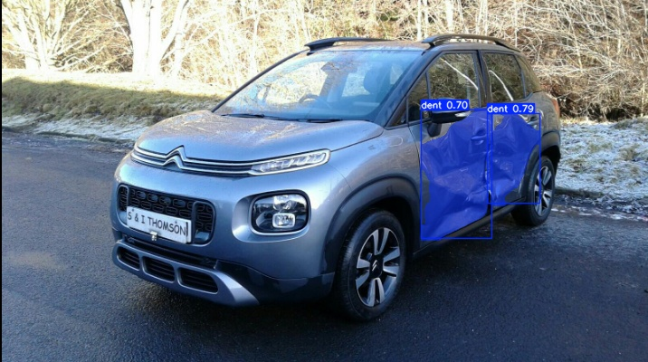

# AutoInspect Car Damage Segmentation

[](https://github.com/DedovInside/AutoInspect/tree/ml/ml)
[](https://huggingface.co/mitbersh/car-damage-segmentation)
[](https://www.ultralytics.com/)
[]()
[]()



Модель сегментации повреждений автомобиля из проекта **AutoInspect**.

## О модели

- **Backbone / model family:** `YOLOv26-s` / Ultralytics segmentation model
- **Задача:** instance segmentation повреждений автомобиля
- **Input image size:** `896`
- **Классы:** 6 типов повреждений из CarDD
- **Главный фокус:** аккуратная локализация небольших и тонких повреждений: царапин, трещин, сколов, повреждений фар и стекла

`Damage Segmentation` - одна из двух основных runtime-моделей AutoInspect.

Она отвечает за поиск и сегментацию зон повреждений на фотографии автомобиля:

- вмятин;
- царапин;
- трещин;
- повреждений стекла;
- повреждений фар;
- повреждений шин.

Модель возвращает instance masks, bbox и confidence для каждого найденного повреждения. Эти маски затем сопоставляются с масками деталей из `Part Segmentation General`.

Основная задача в production-пайплайне:

```text
damage mask -> affected car part
```

Модель должна не только найти повреждение, но и дать достаточно точную маску, чтобы inference-сервис мог понять, какая деталь автомобиля повреждена: например, `front-bumper`, `hood`, `left_front-door` или `right_fender`.

## Роль в ML-пайплайне

Текущий runtime-пайплайн строится вокруг двух segmentation-моделей:

```text
Input image
    ↓
Part Segmentation General
    ↓
Damage Segmentation
    ↓
Mask matching: damages -> parts
    ↓
Structured JSON response for backend
```

## Быстрый старт

#### 1. Установка зависимостей для инференса

```bash
pip install -r requirements.infer.txt
```

#### 2. Скачать модель

```bash
python -c "from huggingface_hub import hf_hub_download; hf_hub_download(repo_id='mitbersh/car-damage-segmentation', filename='car_damage_model.pt', local_dir='.')"
```

#### 3. Запустить инференс

```bash
python infer_damage.py --source "path/to/car.jpg" --model "car_damage_model.pt" --imgsz 896 --conf 0.25 --iou 0.70 --device auto --save --json "outputs/damage_predictions.json"
```

## Что сохраняет infer-скрипт

Скрипт `infer_damage.py` сохраняет:

- визуализации предсказаний в [runs/segment/runs/damage_infer/predict](runs/segment/runs/damage_infer/predict);
- JSON с предсказаниями, если указан `--json` или используется путь по умолчанию;
- для каждого damage instance: `damage_id`, `class_id`, `class_name`, `confidence`, `bbox_xyxy`, `bbox_xywh`, `mask_area_px`, `mask_polygon_xy`, `mask_polygon_xyn`.

## Классы

Схема классов основана на CarDD и загружается из весов модели во время инференса.

Ожидаемая схема классов:

```python
CLASS_NAMES = [
    "crack",
    "dent",
    "glass_shatter",
    "lamp_broken",
    "scratch",
    "tire_flat",
]
```

## Датасет

YOLO-датасет: [mitbersh/car-damage-segmentation-yolo](https://huggingface.co/datasets/mitbersh/car-damage-segmentation-yolo)

Источник: [CarDD: A New Dataset for Vision-based Car Damage Detection](https://cardd-ustc.github.io/)

Датасет оставлен в gated-режиме на Hugging Face, потому что исходные данные CarDD имеют ограничения на перераспространение.

## Обучение

Обучение проводилось в [Kaggle](https://www.kaggle.com/code/brshtskmit/train-car-damage-segmentation-yolov26-s-cardd).

- модель: `YOLOv26-s`
- размер изображения: `896`
- датасет: `mitbersh/car-damage-segmentation-yolo`
- основной фокус: высокая детализация damage masks при сохранении practical inference speed

### Почему используется повышенное разрешение

Для damage segmentation особенно важны мелкие визуальные детали.

Царапины, тонкие трещины, небольшие сколы и локальные повреждения часто занимают очень маленькую часть изображения. Поэтому для этой модели используется более высокое разрешение инференса:

```text
imgsz = 896
```

При обучении также проверялись конфигурации с `imgsz=1024`, чтобы оценить баланс между качеством сегментации мелких повреждений и скоростью инференса.


## Метрики

> Поле оставлено пустым демонстративно. Заполнить после финального выбора run / export из Kaggle / Comet.

| Метрика | Значение |
|---|---:|
| `box/mAP50` |  |
| `box/mAP50-95` |  |
| `seg/mAP50` |  |
| `seg/mAP50-95` |  |
| `precision` |  |
| `recall` |  |
| `fitness` |  |

## Артефакты

- Модель: https://huggingface.co/mitbersh/car-damage-segmentation
- YOLO-датасет: https://huggingface.co/datasets/mitbersh/car-damage-segmentation-yolo
- Обучение: https://www.kaggle.com/code/brshtskmit/train-car-damage-segmentation-yolov26-s-cardd
- Источник CarDD: https://cardd-ustc.github.io/
- SuperviselyPerspective: https://github.com/brshtsk/SuperviselyPerspective
- SuperviselyPartsTags: https://github.com/brshtsk/SuperviselyPartsTags
