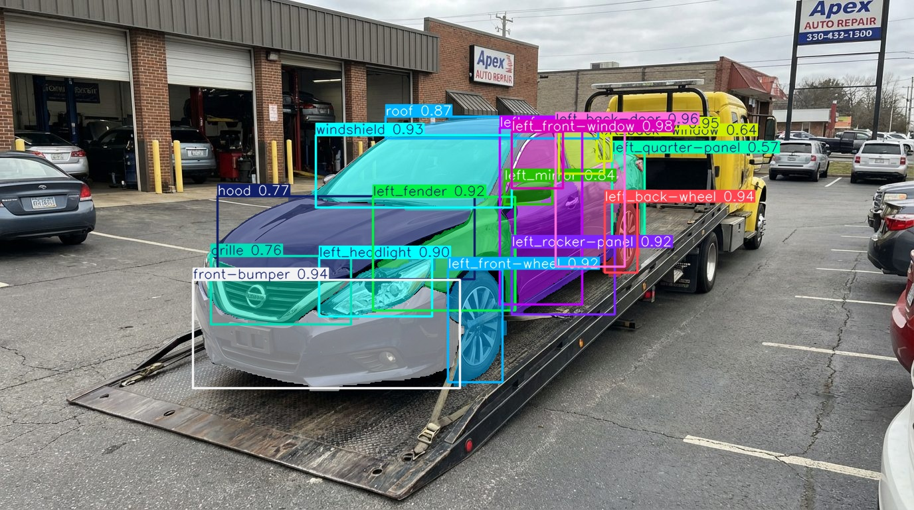

# AutoInspect Car Parts Segmentation

[](https://github.com/DedovInside/AutoInspect/tree/ml/ml)
[](https://huggingface.co/mitbersh/car-parts-segmentation)
[](https://www.ultralytics.com/)
[]()
[]()



Модель сегментации основных деталей автомобиля из проекта **AutoInspect**.

## О модели

- **Backbone / model family:** `YOLOv26-s` / Ultralytics segmentation model
- **Задача:** instance segmentation деталей автомобиля
- **Input image size:** `768`
- **Классы:** 33 side-aware класса
- **Главная особенность:** модель различает `left` / `right` для парных деталей

Она находит основные внешние элементы автомобиля:

- бампер;
- капот;
- багажник;
- двери;
- крылья;
- фары;
- окна;
- колеса;
- зеркала;
- крышу;
- номерной знак;
- другие крупные кузовные элементы.

Для парных деталей используется side-aware разметка: например, `left_front-door`, `right_headlight`, `left_fender`, `right_tail-light`.

Основная задача в production-пайплайне:

```text
damage mask -> affected car part
```

Модель должна не просто найти поврежденную область рядом с автомобилем, а помочь понять, какая именно деталь повреждена: например, `left_front-door`, `right_fender` или `front-bumper`.
Корректность left/right была отдельно проверена через дополнительные метрики, описанные ниже.

## Роль в ML-пайплайне

Текущий runtime-пайплайн строится вокруг двух segmentation-моделей:

```text
Input image
    ↓
Part Segmentation General
    ↓
Damage Segmentation
    ↓
Mask matching: damages -> parts
    ↓
Structured JSON response for backend
```

## Быстрый старт

#### 1. Установка зависимостей для инференса

```bash
pip install -r requirements.infer.txt
```

#### 2. Скачать модель

```bash
python -c "from huggingface_hub import hf_hub_download; hf_hub_download(repo_id='mitbersh/car-parts-segmentation', filename='parts_segmentation.pt', local_dir='.')"
```

#### 3. Запустить инференс

```bash
python infer_parts.py --source "path/to/car.jpg" --model "parts_segmentation.pt" --imgsz 768 --conf 0.25 --iou 0.70 --device auto --save --json "outputs/parts_predictions.json"
```

## Что сохраняет infer-скрипт

Скрипт `infer_parts.py` сохраняет:

- визуализации предсказаний в [runs/segment/runs/parts_infer/predict](runs/segment/runs/parts_infer/predict);
- JSON с предсказаниями, если указан `--json` или используется путь по умолчанию;
- для каждого объекта: `class_id`, `class_name`, `confidence`, `bbox_xyxy`, `bbox_xywh`, `mask_polygon_xy`, `mask_polygon_xyn`.

## Классы

```python
CLASS_NAMES = [
    "back-bumper",
    "back-windshield",
    "center-tail-light",
    "front-bumper",
    "grille",
    "hood",
    "left_back-door",
    "left_back-wheel",
    "left_back-window",
    "left_fender",
    "left_front-door",
    "left_front-wheel",
    "left_front-window",
    "left_headlight",
    "left_mirror",
    "left_quarter-panel",
    "left_rocker-panel",
    "left_tail-light",
    "license-plate",
    "right_back-door",
    "right_back-wheel",
    "right_back-window",
    "right_fender",
    "right_front-door",
    "right_front-wheel",
    "right_front-window",
    "right_headlight",
    "right_mirror",
    "right_quarter-panel",
    "right_rocker-panel",
    "right_tail-light",
    "roof",
    "trunk",
    "windshield",
]
```

## Датасет

Публичный YOLO-датасет: [mitbersh/car-parts-segmentation-yolo](https://huggingface.co/datasets/mitbersh/car-parts-segmentation-yolo)

RAW/Supervisely версия: [mitbersh/car-parts-segmentation-raw](https://huggingface.co/datasets/mitbersh/car-parts-segmentation-raw)

Источник исходной разметки: [Humans in the Loop - Car Parts and Car Damages Dataset](https://humansintheloop.org/resources/datasets/car-parts-and-car-damages-dataset/)

Датасет был адаптирован под задачу AutoInspect:

- для парных деталей добавлена сторона `left` / `right`;
- данные подготовлены в формате YOLO segmentation;
- произведен сплит на train/val/test с учетом распределения классов, side деталей и ракурсов фото.

### Supervisely Apps

Для подготовки и разметки данных использовались Supervisely Apps:

- [SuperviselyPerspective](https://github.com/brshtsk/SuperviselyPerspective) - инструмент для проставления тега с ракурсом автомобиля;
- [SuperviselyPartsTags](https://github.com/brshtsk/SuperviselyPartsTags) - инструмент для добавления side-тегов деталей с отдельным тегом для спорных моментов. Для работы использует теги, подготовленные SuperviselyPerspective.

Эти инструменты помогли подготовить датасет так, чтобы модель могла различать парные элементы автомобиля: `left_*` и `right_*`.

### Train / validation / test split

Для разбиения использовался [greedy splitter](dataset/export_and_split.py).  
Он сохраняет баланс по ракурсам автомобиля (`car_view`) и старается равномерно распределить между `train`, `val` и `test`:

- классы деталей;
- базовые классы без стороны;
- `left / right / neutral`;
- side-aware классы парных деталей.

Доступен [HF отчет о качестве сплита](https://huggingface.co/datasets/mitbersh/car-parts-segmentation-yolo/tree/main/split_analysis).

## Обучение

Обучение проводилось в [Kaggle](https://www.kaggle.com/code/brshtskmit/train-car-parts-segmentation-yolov26-s) с логированием экспериментов в [Comet](https://www.comet.com/brshtsk/car-parts-yolo26s-no-resnet/view/new/panels).

- модель: `YOLOv26-s`
- размер изображения: `768`
- датасет: `mitbersh/car-parts-segmentation-yolo`
- дополнительная проверка: side-aware left/right quality evaluation

## Метрики

| Метрика | Значение |
|---|---:|
| `seg/mAP50` | 0.861366 |
| `seg/mAP50-95` | 0.605276 |
| `box/mAP50-95` | 0.649714 |
| `lr/part_recall_bbox50` | 0.818702 |
| `lr/part_precision_bbox50` | 0.856287 |
| `lr/side_accuracy_when_found_bbox50` | 0.997669 |
| `lr/strict_side_recall_bbox50` | 0.816794 |
| `lr/strict_side_precision_bbox50` | 0.854291 |
| `lr/strict_side_f1_bbox50` | 0.835122 |

## Проверка left/right качества

Так как для AutoInspect критично понимать сторону детали, модель проверялась не только стандартными YOLO segmentation-метриками.

Дополнительно считались метрики качества определения стороны для парных деталей.

Идея проверки:

1. взять GT-объекты, у которых есть сторона `left` / `right`;
2. взять предсказанные side-aware объекты;
3. сматчить GT и prediction по одной и той же базовой детали через bbox IoU;
4. проверить, совпала ли сторона: `gt_side == pred_side`;
5. посчитать summary-метрики, per-part таблицу и список ошибок.

Используемые метрики:

| Метрика | Смысл |
|---|---|
| `lr/part_recall_bbox50` | Доля GT side-aware объектов, для которых найдена предсказанная деталь того же типа при `bbox IoU >= 0.50` |
| `lr/part_precision_bbox50` | Доля predicted side-aware объектов, которые сматчились с GT деталью того же типа при `bbox IoU >= 0.50` |
| `lr/side_accuracy_when_found_bbox50` | Accuracy стороны среди объектов, где нужная базовая деталь была найдена |
| `lr/strict_side_recall_bbox50` | Строгий recall: деталь должна быть найдена и сторона должна совпасть |
| `lr/strict_side_precision_bbox50` | Строгий precision: prediction должен попасть в правильную деталь и правильную сторону |
| `lr/strict_side_f1_bbox50` | F1 по строгим side-aware precision/recall |
| `lr/matched_same_part_bbox50` | Количество матчей GT/prediction по одной базовой детали |
| `lr/correct_side_bbox50` | Количество матчей с правильной стороной |
| `lr/wrong_side_bbox50` | Количество матчей с неправильной стороной |

Также строились артефакты для анализа ошибок:

- `per_part_lr_df` - качество left/right по каждой базовой детали;
- `match_df` - все сматченные GT/prediction пары;
- `error_df` - только ошибки стороны;
- `sweep_df` - sweep по `conf` для выбора рабочего threshold.

Это позволило отдельно проверить, что модель действительно понимает `left` / `right`, а не просто хорошо сегментирует детали.

## Файлы

- `infer_parts.py` - инференс модели сегментации деталей
- `requirements.infer.txt` - зависимости для инференса
- `README.md` - описание модели, датасета, запуска и метрик

## Артефакты

- Модель: https://huggingface.co/mitbersh/car-parts-segmentation
- YOLO-датасет: https://huggingface.co/datasets/mitbersh/car-parts-segmentation-yolo
- RAW/Supervisely датасет: https://huggingface.co/datasets/mitbersh/car-parts-segmentation-raw
- Обучение: https://www.kaggle.com/code/brshtskmit/train-car-parts-segmentation-yolov26-s
- Comet: https://www.comet.com/brshtsk/car-parts-yolo26s-no-resnet/view/new/panels
- Источник HITL: https://humansintheloop.org/resources/datasets/car-parts-and-car-damages-dataset/
- SuperviselyPerspective: https://github.com/brshtsk/SuperviselyPerspective
- SuperviselyPartsTags: https://github.com/brshtsk/SuperviselyPartsTags
